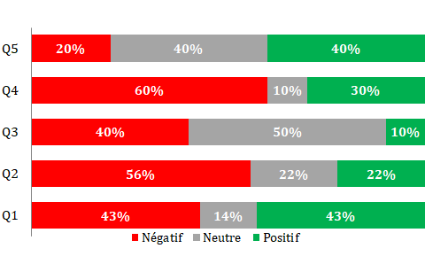

# Visualiser un écart

L'écart peut être défini comme les variations (+/-) par rapport à un point de référence fixe. Habituellement, le point de référence est zéro, mais il peut aussi être une cible dans le cadre d'une prévision par exemple ou d'une moyenne. Ce type d'instrument peut également être utilisé pour analyser l'opinion (positive/neutre/négative).

Exemples d'utilisation : excédent/déficit commercial, changement climatique.

Types de graphiques :

* diagramme à barres divergent : un simple diagramme à barres standard qui peut gérer les valeurs de magnitude négatives et positives.

<figure><figcaption>
Benchmark de la qualité de prévision du PIB
</figcaption></figure>

* diagramme à barres divergent empilé : parfait pour présenter les résultats d'une enquête qui impliquent une opinion (par exemple, désaccord, neutralité, accord).

<figure><figcaption>
Résultats d'une enquête d'opinion
</figcaption></figure>

* diagramme à colonnes : divise une valeur unique en deux composants contrastants (par exemple, masculin/féminin).
* graphique en ligne avec remplissage de l'excédent/déficit : la zone ombrée du graphique permet de montrer l'équilibre par rapport à une ligne de base ou entre deux séries.
