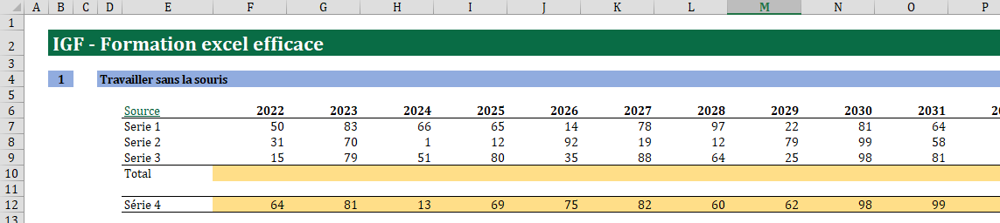

# Travailler au format IGF

## Importer le thème IGF depuis un fichier Powerpoint ou Word

* Depuis l’onglet « Mise en page », section « Thèmes », « Rechercher les thèmes ».
* Attention les couleurs des graphiques ne sont pas celles de la charte IGF.

## Quelques règles de mise en page

* Les quatre premières colonnes (A à D) du feuillet doivent être de largeur « 3 ».
* La deuxième ligne doit être remplie au vert IGF, le texte doit être en blanc, Cambria 18 gras.
* Organiser l’information dans le reste de la page en sections, avec un numéro en colonne B et un titre en colonne D, le contenu n’étant présenté qu’à partir de la colonne E ;

## Quelques conseils pour présenter les données

* De manière générale privilégier une présentation à l’horizontale plutôt qu’à la verticale.
* Toujours indiquer la source des données, soit dans une cellule en haut à gauche du tableau, soit dans une colonne à part, idéalement accompagnée d’un lien hypertexte (CRTL + K).

<figure><figcaption>
Suggestion de mise en page
</figcaption></figure>
